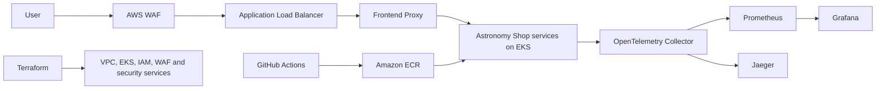

# Astronomy Shop Production DevOps Project

[](https://github.com/Deploytitans/Devops-Project/actions/workflows/ci-cd.yaml?query=branch%3Amain+event%3Apush)

This repository productionizes the OpenTelemetry Astronomy Shop demo across
the application, container, infrastructure, security, observability, and
delivery layers.

The implementation uses **GitHub Actions** for CI/CD and **Amazon EKS** for
deployment. Terraform provisions the AWS platform, Helm and Kubernetes
manifests deploy the application, and OpenTelemetry, Prometheus, Grafana, and
Jaeger provide observability.

> This project is based on the
> [OpenTelemetry Demo](https://github.com/open-telemetry/opentelemetry-demo).
> The production platform and delivery implementation in this repository are
> maintained by this project.

## What is implemented

| Requirement | Implementation |
|---|---|
| Containerization | Multi-stage, minimized Docker builds for 20 images, non-root execution where supported, current runtime images, BuildKit caching, SBOMs, provenance, and Trivy scanning |
| Deployment | Private Amazon EKS cluster across three Availability Zones, AWS ALB ingress, ECR, Helm, and Terraform |
| Autoscaling | Kubernetes HPAs for key services and Cluster Autoscaler for an EKS node group of 2-8 nodes |
| Monitoring | OpenTelemetry Collector, Prometheus, Grafana, Jaeger, CloudWatch EKS logs, and VPC Flow Logs |
| Security | AWS WAF, CloudTrail, GuardDuty, Security Hub, KMS, encrypted storage, OIDC, IRSA, NetworkPolicies, and hardened pod security contexts |
| CI/CD | GitHub Actions: test, validate, scan, build, attest, push to ECR, deploy to EKS, and verify the public endpoint |

## Architecture



Application workloads run in private subnets. The EKS API is private, so the
deployment stage runs on a self-hosted GitHub Actions runner with VPC access.
Build and test jobs remain on GitHub-hosted runners.

## CI/CD flow

Pull requests execute:

1. Native tests for the Go, .NET, Node.js, Python, and Ruby services.
2. Terraform validation and Helm lint/template validation.
3. Trivy source, dependency, secret, and IaC scanning.
4. Parallel BuildKit builds for all 20 container images.
5. A report of high and critical image findings.
6. A blocking gate for fixable critical image vulnerabilities.

When the required AWS deployment variables are configured, a push or merge to
`main` additionally:

1. Authenticates to AWS with GitHub OIDC and short-lived credentials.
2. Publishes immutable images, SBOMs, and provenance to Amazon ECR.
3. Deploys the pinned Helm release to EKS using `--atomic`.
4. Applies the ingress, security policies, and HPAs.
5. Waits for healthy deployments and verifies the ALB endpoint.

The deployment requires the AWS infrastructure, protected GitHub environment,
repository variables, and VPC-connected runner described in the
[production runbook](docs/production-deployment.md).
Until those values exist, the workflow continues to test, build, and scan all
images locally and clearly marks the EKS deployment as skipped.

## Run locally

Prerequisites:

- Docker Desktop or Docker Engine with Compose v2
- GNU Make (recommended)
- At least 6 GB of available container memory

Start the complete application:

```bash
make start
```

Open:

- Shop: <http://localhost:8080>
- Jaeger: <http://localhost:8080/jaeger/ui>
- Grafana: <http://localhost:8080/grafana/>
- Load generator: <http://localhost:8080/loadgen/>
- Feature flags: <http://localhost:8080/feature/>

Stop the application and remove its local volumes:

```bash
make stop
```

Without Make, use:

```bash
docker compose up --detach --force-recreate --remove-orphans
docker compose down --volumes --remove-orphans
```

## Deploy to AWS

The safe deployment sequence is:

```bash
cd infra/terraform
cp terraform.tfvars.example terraform.tfvars
# Edit terraform.tfvars before continuing.
terraform init \
  -backend-config="bucket=YOUR_TERRAFORM_STATE_BUCKET" \
  -backend-config="key=astronomy-shop/production.tfstate" \
  -backend-config="region=ap-south-1" \
  -backend-config="use_lockfile=true" \
  -backend-config="encrypt=true"
terraform plan -out=tfplan
terraform apply tfplan
```

After configuring the GitHub `production` environment and runner, merge a
reviewed pull request into `main`. The pipeline performs the image publication,
deployment, and verification automatically.

Do not apply this stack without reviewing the cost warning and teardown steps
in the production runbook. It creates billable EKS, EC2, NAT Gateway, ALB,
storage, logging, and security resources.

## Repository guide

| Path | Purpose |
|---|---|
| `.github/workflows/ci-cd.yaml` | Complete GitHub Actions CI/CD pipeline |
| `src/` | Application services and production Dockerfiles |
| `infra/terraform/` | AWS VPC, EKS, ECR, IAM, logging, and security infrastructure |
| `deploy/helm/` | Production Helm values and resource settings |
| `deploy/kubernetes/` | Namespace, ingress, autoscaling, and security policies |
| `scripts/deploy-eks.sh` | Idempotent EKS deployment orchestration |
| `scripts/verify-deployment.sh` | Rollout and external endpoint verification |
| `docs/project-overview.md` | Presentation-friendly project explanation |
| `docs/production-deployment.md` | Detailed deployment and operations runbook |

## Documentation

- [Project overview and handoff guide](docs/project-overview.md)
- [GitHub Actions, Jenkins, and port 8080 explained](docs/ci-cd-and-ports.md)
- [Production deployment runbook](docs/production-deployment.md)
- [Contributing guide](CONTRIBUTING.md)

## Important production note

Kafka, Valkey, and PostgreSQL are deployed inside Kubernetes for this
educational implementation. Before processing business-critical customer data,
replace them with managed services such as Amazon MSK, ElastiCache or
MemoryDB, and RDS or Aurora, and add backup/restore and disaster-recovery tests.

## License

The application remains available under the [Apache 2.0 License](LICENSE).
