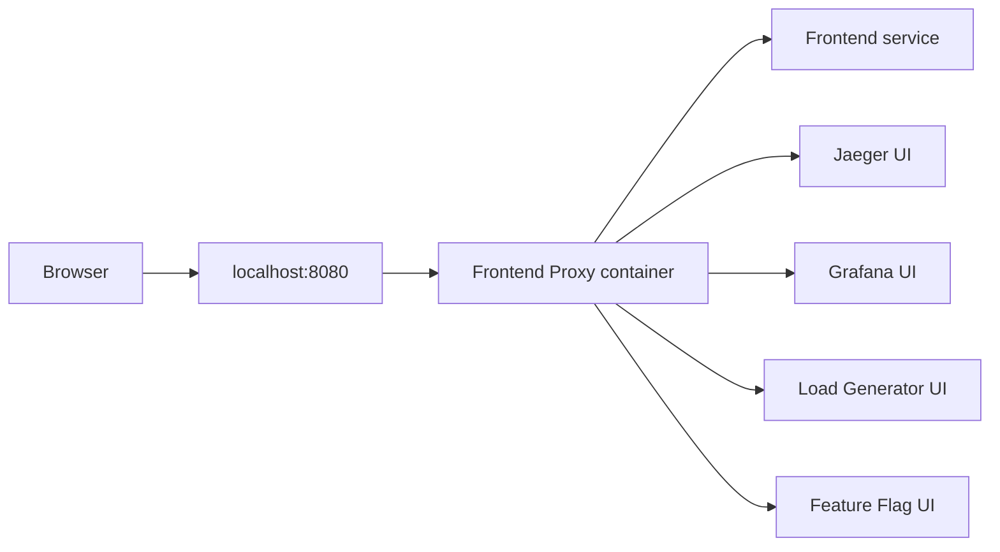
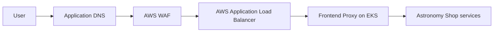

# CI/CD Tool and Port 8080 Explained

## Short answer

This project uses **GitHub Actions for CI/CD**. It does **not** use Jenkins.

Port `8080` is the local entry point for the Astronomy Shop application. The
fact that Jenkins often uses port `8080` does not mean that every application
on port `8080` is Jenkins.

## GitHub Actions or Jenkins?

| Question | Answer for this repository |
|---|---|
| CI/CD tool | GitHub Actions |
| Pipeline definition | `.github/workflows/ci-cd.yaml` |
| Jenkins server required | No |
| `Jenkinsfile` present | No |
| Pipeline execution | GitHub-hosted runners for CI and a VPC-connected self-hosted GitHub runner for EKS deployment |
| Deployment platform | Amazon EKS |

GitHub Actions starts automatically for pull requests and pushes to `main`.
The implemented pipeline covers:

```text
Code
  -> Test
  -> Validate Terraform and Helm
  -> Scan source, dependencies, secrets, and IaC
  -> Build 20 container images
  -> Scan container images
  -> Generate SBOM and provenance
  -> Push images to Amazon ECR
  -> Deploy to Amazon EKS
  -> Verify the rollout and application endpoint
```

ECR publication and EKS deployment run only after the required AWS
infrastructure and GitHub variables are configured. Until then, GitHub Actions
still tests, builds, and scans the complete repository locally in its runners.

## What is using port 8080?

When the project runs with Docker Compose, `frontend-proxy` exposes the
application on the host's port `8080`. It acts as the gateway for the shop and
the observability user interfaces.

| Address | Purpose |
|---|---|
| `http://localhost:8080` | Astronomy Shop user interface |
| `http://localhost:8080/jaeger/ui` | Jaeger distributed tracing interface |
| `http://localhost:8080/grafana/` | Grafana dashboards |
| `http://localhost:8080/loadgen/` | Load Generator interface |
| `http://localhost:8080/feature/` | Feature flag interface |

Port numbers are reusable identifiers. Different applications may use the same
default port as long as they are not trying to bind that port on the same host
at the same time.

For example:

- Jenkins commonly defaults to port `8080`.
- This project also defaults to port `8080` for its local frontend proxy.
- They are unrelated applications.
- They conflict only if both run on the same machine and both try to use host
  port `8080` simultaneously.

## How to prove that Jenkins is not used

The repository contains its pipeline at:

```text
.github/workflows/ci-cd.yaml
```

The workflow uses GitHub Actions such as:

- `actions/checkout`
- `docker/setup-buildx-action`
- `docker/build-push-action`
- `aws-actions/configure-aws-credentials`
- `aws-actions/amazon-ecr-login`
- `aquasecurity/trivy-action`

There is no `Jenkinsfile`, Jenkins controller configuration, Jenkins agent
configuration, or Jenkins container in the production implementation.

## Local request flow



GitHub Actions does not run on port `8080`. It runs remotely on GitHub runners
and communicates with GitHub, container registries, and AWS through their APIs.

## Production request flow

In AWS, users do not access `localhost:8080`. The request path is:



The ALB handles public HTTP/HTTPS traffic and forwards it to the Kubernetes
service. Container ports remain internal implementation details.

## What if Jenkins is already running locally?

If Jenkins already occupies host port `8080`, Docker cannot publish the shop on
that same port. Typical options are:

1. Stop Jenkins while running the shop.
2. Reconfigure Jenkins to another port.
3. Change the shop's host-side port mapping, for example from `8080:8080` to
   `8081:8080`, then open `http://localhost:8081`.

Changing the host-side port does not change the CI/CD tool. The project still
uses GitHub Actions.

## One-minute explanation for a presentation

> Our CI/CD tool is GitHub Actions, not Jenkins. The workflow is stored in
> `.github/workflows/ci-cd.yaml` and automates testing, security scanning,
> building 20 images, publishing to ECR, deploying to EKS, and verification.
> Port 8080 appears in the README because it is the local frontend-proxy port
> for the Astronomy Shop. Jenkins also commonly defaults to 8080, but a port
> number does not identify the software using it. No Jenkins server or
> Jenkinsfile is part of this implementation.

## Related documentation

- [Main project README](../README.md)
- [Project overview](project-overview.md)
- [Production deployment runbook](production-deployment.md)
