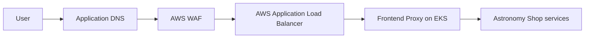

# CI/CD Tool and Local Ports Explained

## Short answer

This project uses **GitHub Actions for CI/CD**. It does **not** use Jenkins.

Port `8081` is the local entry point for the Astronomy Shop application. The
container continues to listen internally on port `8080`, but Docker publishes
it as `8081` on the host to avoid Jenkins' common default port.

## GitHub Actions or Jenkins?

| Question | Answer for this repository |
|---|---|
| CI/CD tool | GitHub Actions |
| Pipeline definition | `.github/workflows/ci-cd.yaml` |
| Jenkins server required | No |
| `Jenkinsfile` present | No |
| Pipeline execution | GitHub-hosted runners for CI and a VPC-connected self-hosted GitHub runner for EKS deployment |
| Deployment platform | Amazon EKS |

GitHub Actions starts automatically for pull requests and pushes to `main`.
The implemented pipeline covers:

```text
Code
  -> Test
  -> Validate Terraform and Helm
  -> Scan source, dependencies, secrets, and IaC
  -> Build 20 container images
  -> Scan container images
  -> Generate SBOM and provenance
  -> Push images to Amazon ECR
  -> Deploy to Amazon EKS
  -> Verify the rollout and application endpoint
```

ECR publication and EKS deployment run only after the required AWS
infrastructure and GitHub variables are configured. Until then, GitHub Actions
still tests, builds, and scans the complete repository locally in its runners.

## What is using port 8081?

When the project runs with Docker Compose, `frontend-proxy` exposes the
application on the host's port `8081`. It acts as the gateway for the shop and
the observability user interfaces.

| Address | Purpose |
|---|---|
| `http://localhost:8081` | Astronomy Shop user interface |
| `http://localhost:8081/jaeger/ui` | Jaeger distributed tracing interface |
| `http://localhost:8081/grafana/` | Grafana dashboards |
| `http://localhost:8081/loadgen/` | Load Generator interface |
| `http://localhost:8081/feature/` | Feature flag interface |

Port numbers are reusable identifiers. Different applications may use the same
default port as long as they are not trying to bind that port on the same host
at the same time.

For example:

- Jenkins commonly defaults to port `8080`.
- This project uses host port `8081` for its local frontend proxy.
- They are unrelated applications.
- The frontend-proxy container still uses internal port `8080`; Docker maps
  host port `8081` to it, so it does not conflict with Jenkins on host port
  `8080`.

## How to prove that Jenkins is not used

The repository contains its pipeline at:

```text
.github/workflows/ci-cd.yaml
```

The workflow uses GitHub Actions such as:

- `actions/checkout`
- `docker/setup-buildx-action`
- `docker/build-push-action`
- `aws-actions/configure-aws-credentials`
- `aws-actions/amazon-ecr-login`
- `aquasecurity/trivy-action`

There is no `Jenkinsfile`, Jenkins controller configuration, Jenkins agent
configuration, or Jenkins container in the production implementation.

## Local request flow


GitHub Actions does not run on port `8080`. It runs remotely on GitHub runners
and communicates with GitHub, container registries, and AWS through their APIs.

## Production request flow

In AWS, users do not access `localhost:8081`. The request path is:



The ALB handles public HTTP/HTTPS traffic and forwards it to the Kubernetes
service. Container ports remain internal implementation details.

## What if Jenkins is already running locally?

Jenkins can continue using host port `8080` while the shop uses `8081`.
The effective Docker mapping is:

```text
localhost:8081 -> frontend-proxy container:8080
```

If port `8081` is also occupied, typical options are:

1. Stop the process using `8081`.
2. Set `FRONTEND_PROXY_PORT` in `.env` to another unused host port.
3. Open the shop using that new host port.

Changing the host-side port does not change the CI/CD tool. The project still
uses GitHub Actions.

## One-minute explanation for a presentation

> Our CI/CD tool is GitHub Actions, not Jenkins. The workflow is stored in
> `.github/workflows/ci-cd.yaml` and automates testing, security scanning,
> building 20 images, publishing to ECR, deploying to EKS, and verification.
> The shop uses `localhost:8081`; Docker maps that host port to port `8080`
> inside the frontend-proxy container. Jenkins can therefore keep its common
> host port `8080`. CI/CD is still implemented by GitHub Actions, and no
> Jenkins server or Jenkinsfile is part of this project.

## Related documentation

- [Main project README](../README.md)
- [Project overview](project-overview.md)
- [Production deployment runbook](production-deployment.md)
