# Production DevOps Project Overview

## Executive summary

This project converts a multi-language OpenTelemetry microservices application
into a production-oriented AWS workload. It covers frontend and backend
services, data services, containers, Kubernetes deployment, AWS
infrastructure, security, monitoring, autoscaling, and automated delivery.

The selected platform is **Amazon EKS**, and the selected CI/CD system is
**GitHub Actions**.

EKS was selected because the application contains many independently scalable
services and already follows a Kubernetes-friendly service model. It supports
consistent health checks, resource controls, pod autoscaling, network policies,
Helm releases, and OpenTelemetry components in one platform.

## Requirement-to-solution mapping

### Task 1: Containerization

The repository builds 20 application and supporting-service images. The
production changes include:

- Multi-stage builds where compilation or dependency installation is needed.
- Lightweight Alpine, slim, or distroless runtime images where appropriate.
- Non-root users for application containers where the upstream image permits.
- Minimal runtime dependencies and removal of build tools and package caches.
- Refreshed and pinned security-sensitive runtime images and helper binaries.
- Parallel Docker BuildKit builds with per-service GitHub Actions caches.
- SBOM and provenance generation for images published from `main`.
- Trivy filesystem, dependency, secret, IaC, and image scanning.

The image policy reports all fixable high and critical findings and blocks the
pipeline when a fixable critical finding remains. Source and IaC findings at
both high and critical severity remain blocking.

### Task 2: Deployment

Terraform creates the AWS platform:

- A VPC spanning three Availability Zones.
- Public, private, and database subnet tiers.
- One NAT Gateway per Availability Zone.
- A private-only Amazon EKS API endpoint.
- An on-demand managed node group with 2 minimum, 3 desired, and 8 maximum
  nodes.
- An immutable, encrypted Amazon ECR repository with scan-on-push enabled.
- IAM roles for GitHub Actions, AWS Load Balancer Controller, and Cluster
  Autoscaler.

Helm installs the pinned OpenTelemetry Demo chart. Additional Kubernetes
manifests configure the namespace, ALB ingress, autoscaling, pod security, and
network policies. The release is deployed atomically so an unsuccessful
rollout returns to the previous working revision.

### Task 3: DevOps and observability

Autoscaling operates at two levels:

| Layer | Behavior |
|---|---|
| Pods | HPAs scale frontend and frontend-proxy from 2-10 replicas and checkout, product-catalog, and recommendation from 2-8 replicas |
| Nodes | Cluster Autoscaler adjusts the EKS managed node group between 2 and 8 nodes |

The monitoring stack contains:

- OpenTelemetry Collector for telemetry ingestion and routing.
- Prometheus with 15-day retention and persistent storage.
- Grafana with persistent storage for dashboards and configuration.
- Jaeger for distributed trace inspection.
- EKS control-plane logs in CloudWatch with 90-day retention.
- VPC Flow Logs for network metadata.

Recommended operational alarms include ALB latency and 5xx responses,
unhealthy targets, node pressure, HPA saturation, failed pods, and
OpenTelemetry Collector export failures.

### Task 4: Security

The implementation demonstrates all four requested AWS security services:

| Service | Use in this project |
|---|---|
| AWS WAF | Protects the ALB with common-threat, known-bad-input, and per-IP rate-limit rules |
| CloudTrail | Records validated, multi-region management events in a versioned and KMS-encrypted S3 bucket |
| GuardDuty | Detects suspicious activity using EKS audit logs and EKS runtime monitoring |
| Security Hub | Aggregates security controls and findings for centralized review |

Additional controls include:

- GitHub OIDC instead of long-lived AWS access keys.
- IRSA roles for Kubernetes controllers.
- Encrypted EBS, ECR, CloudTrail storage, and SNS notifications.
- IMDSv2 enforcement with a hop limit of one on worker nodes.
- Container security contexts that prevent privilege escalation, drop Linux
  capabilities, and use RuntimeDefault seccomp.
- Pod Security Admission and namespace NetworkPolicies.
- EventBridge delivery of GuardDuty and Security Hub findings to encrypted SNS.

### Task 5: CI/CD

The pipeline is implemented in `.github/workflows/ci-cd.yaml`.

```mermaid
flowchart LR
  Code["Code or pull request"] --> Test["Native tests"]
  Test --> Validate["Terraform and Helm validation"]
  Validate --> SourceScan["Source, secret and IaC scan"]
  SourceScan --> Build["Build 20 images"]
  Build --> ImageScan["Image vulnerability gates"]
  ImageScan --> Attest["SBOM and provenance"]
  Attest --> ECR["Push immutable images to ECR"]
  ECR --> Deploy["Atomic Helm deployment to EKS"]
  Deploy --> Verify["Rollout and ALB health verification"]
```



Pull requests stop after successful build and scan validation. Merges and
pushes to `main`, plus approved manual dispatches, publish and deploy when all
required AWS variables are configured. Without them, the workflow continues in
local build-and-scan mode and skips deployment with one clear warning. The
`production` GitHub environment should require reviewers before deployment.

## Repository layout

```text
.
|-- .github/workflows/ci-cd.yaml     CI/CD pipeline
|-- deploy/
|   |-- helm/                        Production Helm values
|   `-- kubernetes/                  Ingress, HPA, namespace and policies
|-- docs/
|   |-- project-overview.md          This handoff document
|   `-- production-deployment.md     Detailed operator runbook
|-- infra/terraform/                 AWS infrastructure as code
|-- scripts/
|   |-- deploy-eks.sh                Deployment orchestration
|   `-- verify-deployment.sh         Post-deployment verification
|-- src/                             Application code and Dockerfiles
|-- docker-compose.yml               Complete local environment
`-- README.md                        Main project entry point
```

## What happens after a merge to main

1. GitHub Actions runs service tests, platform validation, and security scans.
2. Twenty images are built in parallel and scanned.
3. Images are tagged with the Git commit SHA and run attempt.
4. Images, SBOMs, and provenance are published to ECR.
5. A VPC-connected runner authenticates to AWS through OIDC.
6. Helm upgrades the application atomically.
7. Kubernetes ingress, policies, and HPAs are applied.
8. The verification script waits for deployments and tests the ALB URL.

If a build, security gate, rollout, or endpoint check fails, the workflow fails.
Helm's atomic mode protects the last healthy application revision during a
failed rollout.

## Required setup before the first AWS deployment

1. Use an AWS sandbox or approved production account and review expected cost.
2. Create an S3 Terraform state bucket outside this stack.
3. Copy and edit `infra/terraform/terraform.tfvars.example`.
4. Run `terraform plan`, review it, and apply it from a VPC-connected host.
5. Create a protected GitHub environment named `production`.
6. Add the Terraform output values as GitHub variables.
7. Add a regional ACM certificate ARN.
8. Register a VPC-connected self-hosted runner with the labels `self-hosted`,
   `linux`, and `production-vpc`.
9. Configure DNS to point the application hostname to the created ALB.
10. Merge through a reviewed pull request and monitor the deployment job.

The exact variables, Terraform commands, rollback procedure, security-service
considerations, and teardown process are documented in
[the production deployment runbook](production-deployment.md).

## Routine operations

Check application and autoscaling state:

```bash
kubectl get pods,deployments,hpa,ingress -n astronomy-shop
```

Inspect and roll back Helm releases:

```bash
helm history astronomy-shop -n astronomy-shop
helm rollback astronomy-shop PREVIOUS_REVISION \
  -n astronomy-shop --wait
```

Inspect platform logs and security findings in CloudWatch, GuardDuty, and
Security Hub. Use Grafana, Prometheus, and Jaeger for application-level metrics
and traces.

## Current scope and recommended next steps

The repository contains and validates the production implementation. Actual
AWS availability depends on applying Terraform and configuring the required
GitHub environment, AWS account, certificate, DNS, and private runner.

Before using the system for real customer data:

1. Replace in-cluster Kafka, Valkey, and PostgreSQL with managed AWS services.
2. Add tested backup, restore, and cross-region disaster-recovery procedures.
3. Connect CloudWatch and security findings to the organization's on-call tool.
4. Add SLO dashboards and alert thresholds based on measured traffic.
5. Run load, failover, penetration, and recovery tests.
6. Establish dependency and base-image update ownership.

## Short presentation script

> We productionized the full OpenTelemetry Astronomy Shop application using
> GitHub Actions and Amazon EKS. Every pull request runs native tests,
> Terraform and Helm validation, source and infrastructure security scans, and
> builds and scans all 20 images. After merge to main, immutable images with
> SBOM and provenance are pushed to ECR and deployed atomically to a private
> EKS cluster. The platform scales pods and nodes, collects metrics and traces
> with OpenTelemetry, Prometheus, Grafana, and Jaeger, and adds AWS WAF,
> CloudTrail, GuardDuty, and Security Hub controls. Deployment is verified
> automatically through Kubernetes rollout checks and the public ALB endpoint.
